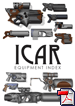

It's here and it's as ropey as anything I've produced but I thought I'd get it out there so you can have a peruse, a ponder and look. It's *really, really, really not finished!* It will (eventually) replace the JPG images and then some. It's not vital yet but it will be one day, have a download. If you find any problems or errata, or typos, then please do post on the forum or send me an [email](mailto:roblang@icar.co.uk). It's an enormous step up from the last version (5.1), which was difficult to print and although had the nice table of prices, did really add anything.

For the eagle eyed, you'll have noticed that Version 6 doesn't exist. It was an abomination. Let's just pretend it doesn't exist. Thanks. :-)