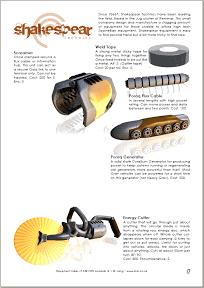

		
Now in Version 7.12, the Equipment Index is coming along very well. I have only three more equipment sheets to finish - some of which already have 3D models for them. I am working on the Shakespear items now, splitting them up from their tech kits into individual items.
		
I also have a load of other tech that needs adding (such as upgrades to equipment) and some examples on how to use the sheets that are included. Some people have mentioned that it's not obvious until explained (thanks guys!) so I'll put some simple instructions in to show what bits do what.
		
## Addionally...
It's late and I've been working on loads of models this evening. I've not quite managed to finish the Shakespear sheet I wanted to today but it should be finished in the coming week. I'll admit to being desperate to show you the new renders, so here's a work in progress!