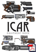

Thank you all for your patience, the Equipment Index first release is now ready for download. It now officially replaces all the downloadable weapon and equipment sheets (it's now removed from the menu on the left). Although released, there is always more that can go in, so it is by far a closed document. Some new features is a section describing how to use the different sheets (folding and reading them) and a better description at the start. Some of the pages appear to need filling but they will become full in short order, no doubt. I have two more vehicles in mind and a new ammo type suggested by Robert Barrows (of Entalis and [Desert Realm](http://www.desertrealm.com/forum) fame) and those will no doubt appear in the future.

What's next? Next up is finishing off the Society book, which is currently bereft of graphics. It's a big job because it needs so much description but I do hope to reuse some of the renders that I have already done as they illustrate facets of Mex cities. I need to provide a more quick-start like section in the book (as suggested by All Games Considered) and I am not sure if that will fit in at the start or at the end.

All comments and critique is best pointed at the forum. 

Also, do you like the new header?