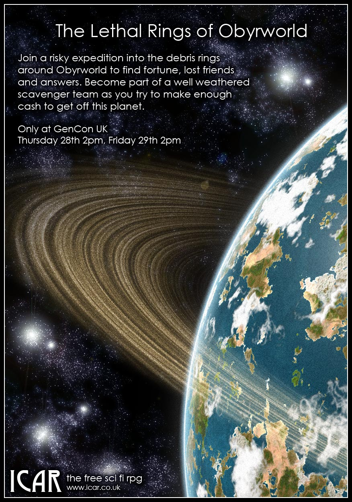

I'm pleased to announce that I will be running two games on Thursday 28th August 2pm and Friday 29th August 2pm at GenCon UK. Here's the advertising information:

## The Lethal Rings of Obyrworld 
> Join a risky expedition into the debris rings around Obyrworld to find fortune, lost friends or answers. Become part of a well weathered Scavenger team as you try to make enough cash to get off this planet.

> Icar is a free Science Fiction tabletop RPG, a mix of familiar Sci Fi elements, space opera and very large guns. No experience expected or required!

It will be a Scavenger-esque scenario where the characters will be a mix of Borg/Cyber and human in powered armour. I can't give too many details of the scenario as I wouldn't want to spoil it but I am taking advice from various online forums about how to write a cracking game. I would love to run the game with new players, so please come along. I appreciate very few have played Icar before so the game will be set up for complete beginners!

## Beady eyes?

For the more beady eyed, you may have noticed that Society is now on version 2.4. There is some improvement in the text but most of the changes are adding graphics. My round aim is to finish the Society version 2 book by the end of the summer.