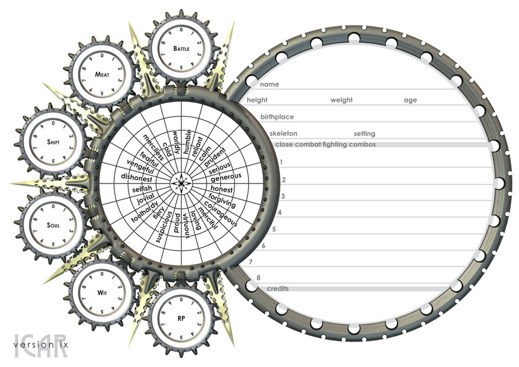
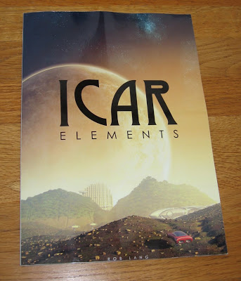

It's been a while since the halcyon days of redesigning the front page of the character sheet every ten minutes. Version 8 of the front character sheet has been around for years now. The new sheet is built into the Elements (version 3.5.6, now uploaded) and it's rendered at print quality (300dpi). The printed result is a much more crisp and detailled effort, with sharp text and cleaner lines.

As a bi-product of the design, I've removed the Fighting wheel. Converting RP over to fighting combo points should be automatic and for anyone that has some spare from the initial character build, they can be recorded elsewhere. Also to fall by the wayside was the 'spare' disc. When I first did the render, I didn't know what it might be needed for. It appears that it's not useful for a lot. The deviant wheel has been made easier to read but the entries remain the same. I'm using century gothic font for the lot. From a designer's point of view, it's a lot easier to edit now as it's not all held in pixels but in type (international versions now much easier to construct, Joe. Just let me know the translations of the words and I can cut and paste them in).

On the right hand side, _description_ has been removed, as has _quote_. I've made more room for _birthplace_ (to allow planet, system, cluster and sector to be added) and added _setting_ too. There is also much more room for close combat fighting combos, something I felt was needed. I removed the circle for drawing the character because (as people have rightly shown), it's better to put it on the body and armour sheet. Finally, an all important _credits_ section has been added, plenty of room for writing the tonnes of cash people acquire and for rubbing it out again. Click the image (right) for a taster but please do download the latest Elements and print from there, the quality is much better. All feedback warmly welcome.

A rather unfortunate side effect of me changing this is that the character sheet generator I was working on will have to change. All the code is there, I just need to tweak the graphics and reposition some boxes. It's a shame, seeing as I was so close but it will need doing. Unfortunately, the online version will not be super-high resolution but that's unavoidable.

## Test print over at Lulu

I've been contemplating printing Icar for some time. I've always wanted to keep it free as I still do not believe it warrants paying for. However, I wanted to find a cost effective way of printing out a few colour copies for my gaming group to use. The poor lot had been using some old black and white early additions of the Elements 3.5 that one of my players (Dwain, I think) had kindly printed and bound. I set up a [LuLu account](http://www.lulu.com) and uploaded the PDF and some special front covers (at 300dpi). I was blown away when the book arrived. Beautiful full colour and glossy. A marvel! My breath was really broken away. Many thanks to the fellows at the RPG Site for endlessly recommending it, supporting and nudging. The service was a little slow (or was I impatient?) but the delivery time was minimal (it only had to travel 40 miles from the printers).

The quality of the print is excellent although with my super critical hat on, I must say that my graphics need some brushing up. You can't quite see it in the photos but some of the graphics are a little too antialiased for my liking. This is because I was rendering for screen, rather than print. The upshot of this is that I will be producing two books - one to upload for Lulu's print on demand and one for people to download. Once all the images are in a high resolution format, the Elements itself will be many tens of MB. There's no need to make them super high res for home printing. It's going to take some time to update a lot of the graphics, so please be patient. I also noticed that having a lot of the pictures without any kind of explanation is slightly odd, so I'll add in some commentary too.

The goal is to make the Elements a purchaseable book. It will be pretty much at cost, the PDF will still be free for those keen on having a look. I know this goes against the grain of The Free Sci Fi RPG but I am sure there are people out there who would like to play it but just don't have the time or inclination to print it out and bind it ready for play. It's very exciting indeed to have the book sitting on the desk in front of me, spurring me on to finish other bits.