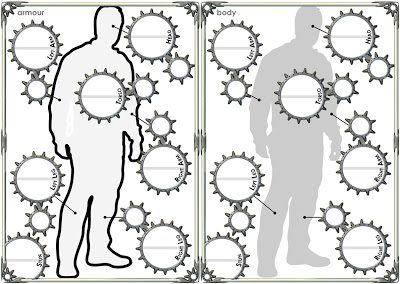

My apologies for blatting your feedreaders with two updates today but I've had a stupidly productive time and I thought I'd share it with you all. This is the new character sheet three (or body/armour sheet in old language). In beautiful high resolution (in Version 4, where this shot was taken from). When folded down the middle, armour appears on the backside. For each section, the Armour Rating (AR) is in the smaller disc and Hit Points (HP) in the larger disc with original value above the line and current value below it. When printed on A4, I've found that the HP discs are fine for writing up to 99,999 and as AR is only two digits so there is plenty of room. 

Psychotheatrics have disappeared off the sheet because there was never really enough room. I will state in the rules that they can be put at the bottom of the Character sheet two on the equipment side. Some (noteably one of my players, Fish) likes to put images from the web in his character. For that, I will provide a massive PSD (which is a layered graphics format made famous by Photoshop but usable with GIMP) template without the outlines or lines-with-spots. That way anyone can put whoever they like in the background.

No doubt there will be people who prefer a grid, and I appreciate that more than most but this sheet must be in keeping with the game itself, which is important. If you're using it a lot, you'll soon get used to it. If you don't, then it won't bother you. I don't think it's so very new that it will act as a barrier to entry (as the dials were) but instead a worthy improvement.

No doubt, I'll keep fiddling with this and the other character sheet but I doubt the layouts will change much. The only addition in the rules will be specially prepared pages that can be printed onto the back of the character sheets that have a rule quick reference. This will be like those pictures and lists in the back of the book but compressed into more helpful sheets. Not needed for everyone but might help the newer players.