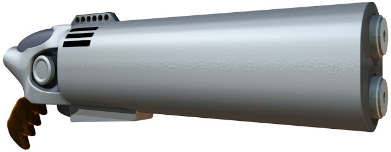

I've been hammering away at the new version of the equipment index (to go with version 4 of the core rules) for months now. I have made a [big list of things I need to do](http://www.1km1kt.net/forum/viewtopic.php?f=34;t=2283) before I release version 4 and the items are slowly getting done. I am currently working my way through remaking some of the old 3D models. Some were lost in a big hard-drive mess up a few years ago and some are just too old and rough to fit in. Here is the new Hellhound. 

## My goals
The next milestone I want to hit is to release the alpha version of the equipment index by the end of February. There are five things left on the list to do and although each one does take a while to complete I think this is achievable. The new equipment index will be in high resolution (300DPI) and is not intended for printing out as one big lump. Instead, the aim is to pick and choose the weapons used in play.

The next milestone after that will be a new version of the Core Rules alpha, which I want to have complete by my birthday in mid-April. I like using my birthday as a deadline because it focuses the mind.

## Other stuff

On top of all that, I am also writing the Fleet setting so that I can run it with my group. It's a very easy setting to write because a lot of it is right there in the forefront of my head. I can spew it out at great speed. I won't release it to everyone until version 4 of the core rules is complete.

## Some thank yous

The community over at [the forum](http://www.1km1kt.net/forum/viewforum.php?f=34) have been wonderful in helping me solve problems and motivating me. Questions, thoughts and comments go a long way to keeping my energy high - especially after a long day at the office. Please keep the questions, comments and ideas coming in!
