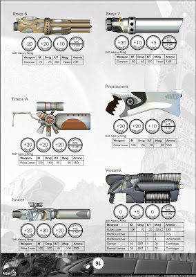

An updated release for the Icar core rules is now on [Google Docs](https://docs.google.com/open?id=0B2ThEbOVGt78NTI0NTY5YWUtZjVjNi00Nzc0LWJkMmYtNWZhMjZjZTU0ZWMx). After stripping a lot of technology out of the equipment index, it needed to be re-rendered, better explained and added into the core rules. I've also included stat blocks for weapons and vehicles.

There is more left to do but this update was important because the equipment and bionics sections were a massive hill to climb and now it's over, the remaining tasks are smaller and more manageable. I thought it was only going to take me a few months but I changed jobs twice and this make it difficult to spend any spare time doing anything else but getting into the groove of my job. I'm in the groove now so I have time I can spend on Icar again. And it feels great.

I am a little concerned that on my next full read through of the rules I will want to change a lot. This is because I've been writing a guide to writing a free RPG for my [blog](http://www.thefreerpgblog.com) and by doing so I've uncovered a lot of excellent advice I didn't know before. By distilling ideas to share with others I will no doubt become very critical of my own work. One piece of advice I've not been able to follow is one of continuous delivery: release small and release often. By using continuous delivery, I think I will try and do more updates and end up working more on it.

I've started sketching a new website too. This one is long in the tooth and is a nightmare on mobile devices. I'll be doing a responsive design for it so that it moulds to whatever device you're using.

If you've got any questions or feedback on this release then [the forum](http://www.1km1kt.net/forum/viewforum.php?f=34) is by far the best way to communicate with me. I'm all over there like a rash. A nasty rash. One you can't scratch without making it worse. You know what I mean.		

