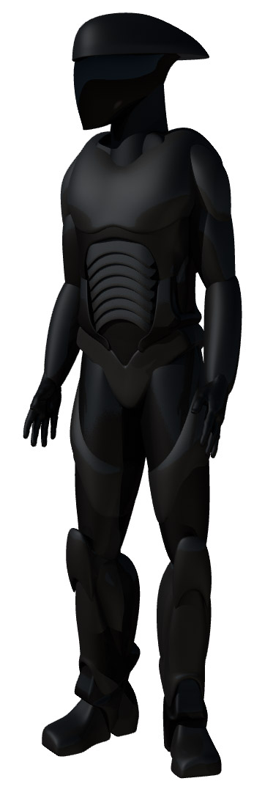

> Troopers are the foot soldiers of the Imperial Star Fleet. Popular culture like to think of a Fleet Trooper as an unthinking mechanical grunt and the media perpetuates this view. It hides the truth that Troopers are highly trained and *better educated* than the general public. While being an effective and tactical fighting force, they retain their humour, pride and humanity; the Fleet has long since recognised that removing a Trooper's humanity reduces their ability to innovate and think laterally to solve problems.

> Each Trooper is equipped with TAFAC powered armour (see right). TAFAC is an artificially intelligent suit that protects the wearer as well as giving the wearer additional abilities such as flight, invisibility, shields, the ability to re-enter atmosphere and survive in space for up to 400 hours. 

I have been toying with this 3D model for months now and I'm still not completely happy with it. So this picture is a work in progress. The arms are too plain, the helmet isn't how I dreamt it should be and there is no plasma grav pack on the back. The hands I've used are from a stock human model and as such have this rather panicked open pose to them. It makes the Trooper look surprised. They will either get 'rigged' for modification or replaced.  

The model is supposed to be thin and lightweight. Icar's style is not about needless bulk - make the armour stronger, not bigger. I think it's delightfully jarring that some might look at this and think that the armour isn't tough enough. The outline is skinny and so it should be - these warriors are svelte because bulk is cumbersome.  

The other glaring omission is equipment. All Troopers are kitted out with a Rapier Cannon (I have an old pencil drawing I must locate) and a whole bunch of toys.  

The Troopers are coming in the Fleet Setting book, which I hope to have an Alpha for this summer. It's the next campaign I want to play, so I must be ready for that.

## Comments

Looks good mate :D. Svelte is good.  I always saw troopers as borgs for some reason, and I always thought of borgs as large, hence the extra room for systems...

by _Unknown (Byrn?)_ on 29 May 2012

Hi Unknown (Byrn, I'm guessing).  

Thanks for the comment, that was certainly the impression I used to give but when writing the Setting book, what didn't make sense was that you needed soldiers that were as close to human as possible. By lessening a soldier's humanity, you reduce their Soul and they become more like a machine. Intuition, innovation and initiative (the having ideas kind, not the mechanical sort) is lessened. These are all things you need in bucket loads when you're outnumbered and outgunned. So you have to retain as much humanity as you can. This means Cyber. The biproduct is that Cyber characters are more interesting to play if you were to leave the Fleet.  

With Imperial tech far and above civilian tech, the Troopers can have tough armour and cool toys without the need of bulk. What's more, they are all powered by Ion generators (I have some more rules regarding those now), so you can have lots of power with little bulk.  

Finally, the equipment is bulky. My god, is it fat. In fact, it's phat. :)

by _Rob Lang_ on 29 May 2012