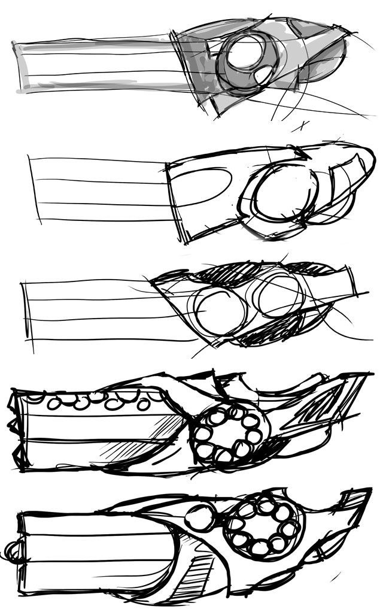

The Rapier cannon is the stock laser weapon for all Fleet Troopers. It's a no-nonsense affair that is sturdy and powerful. It can be used for accuracy and range but it's normally used for throwing as much raw energy at a Droid as it can.  

The best Icar designs start off with a sketch. If I can scribble it down, then creating it in 3D is a lot easier because I have the core of the weapon to work from. I do not have a method of sketching. I plug my Wacom Bamboo (an old one) into the computer, start up Photoshop and away I go!  

I begin with the barrels and work backwards along the weapon. For the back end, I draw large shapes freely and then fill them in. I try experimenting with shading to see if an idea sticks better but I don't worry too much. Here are a few sketches from last night:  

Each one is slightly different and... I don't like any of them very much. Number 4 (from the top) is nearest to the proportions I am looking for and I prefer the detailing on number 5 - but that one is too fat. I hated number 2 shortly after I started, which is why there is so little detail. There's no point flogging the drawing if the shapes are all wrong from the start! 

I'm not happy with any of them and I don't get stuck into 3D until I am. If I can't fix the weapon in 2D then the 3D image will be dire from the start!