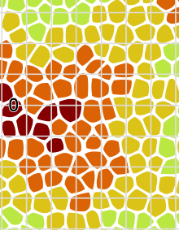
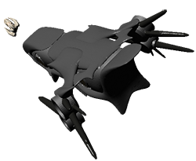

Icar has been updated, the new PDFs are [ready for download](http://www.icar.co.uk) from the homepage. The changes include:  

*   New full colour Sector maps for Dorian, Sayshell and Remmar.
*   Updates to Space Combat
*   Additional rule examples

## The New Sector Maps

It is difficult to represent space because it is really very big, not to mention 3D. I have sidestepped this issue by pretending the Galaxy is pretty much a flat disc. Space is organised into Sectors and Clusters, a Sector containing a bunch of clusters. A Cluster contains systems, a system contains planets, orbitals and so on.  

The Sector maps have been black and white for a long time because I found it very difficult to make them colour and still print sensibly in black and white. While playing with Photoshop recently, it occurred to me that I could select colours and then increase the contrast massively. That should allow me to make them both nice in colour and appear different shades in grayscale.  

The next difficulty that I had was that old sector maps were arranged in a format that was not very easy for me to convert, change or play with. Furthermore, I did not generate the whole Galactic arm - I just did the three sectors of human occupied space. This became a problem because I now need Typhon Sector for the Fleet setting. It was not possible just to generate a single cluster and have it match the others. I decided to regenerate the entire galactic arm again, and then clean it so that I could use it more easily.   

I'm proud of the new maps and am looking forward to getting them printed A3 at my local print shop. 

## Space Combat Update

I took an evening out of our Fleet campaign to playtest the Space Combat rules. Although they have been there for a long time, the only testing I had done was on paper. Although extensive (edge case testing etc), it was not obvious how it would play. A run through with Byrn and Aggro was long overdue.  

The feedback was excellent. I introduced Combat Initiative to give a bonus to spacecraft that are well suited to space combat and adjusted all the to-hit modifier on spacecraft systems. That meant an update to the Equipment Index too, which I'm glad to say did not take long thanks to InDesign's master pages.  

The other changes included turn length becoming 3 minutes and that the initiative modifer only affects the Pilot Manouvring check. Failing the Pilot Manouvring check now gives a modifier to Gunnery. In essence, the teamwork is still there but it is less loaded on the initiate.   

Grab the PDFs now from [the homepage](http://www.icar.co.uk).