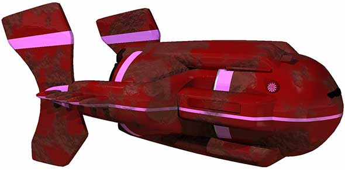
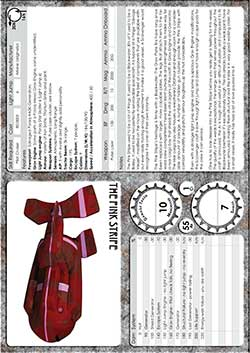

The Pink Stripe is a Scavenger Spacecraft based on a Blackwater design with lots of "modifications". The invention of two of my players "Aggro" and "Byrn" for our current campaign.  

  

Download this ship as either an [image](https://drive.google.com/file/d/0B2ThEbOVGt78RnhVZFV1MmxRY28/edit?usp=sharing) or [PDF](https://drive.google.com/file/d/0B2ThEbOVGt78Q1Atd3ZkR0JhQXc/edit?usp=sharing). Here's the marketing information: 

> The Pink Stripe used to be a lot of things. It used to be a Blackwater. Bits of it used to be a Bailey. It used to be two perfectly serviceable spacecraft. It is typical of a Fringe “Salvage Vessel”, modified on the move, making the best of components that are available without ever really having enough investment to make it a good vessel. A Scavenger would recognise it as one of their own instantly.
 

> The Pink Stripe’s heritage is firmly with a Blackwater. The Grav Plate fins have long since been replaced with larger, more capable plates. The legs that attach them to the forward crew compartment have been bent outwards and strengthened to make way for a rear cargo bay that shields the vital organs of the craft: its Grav Engine and Generator. The rear cargo bay also houses a weathered Orbihaul and enough room for a considerable amount of salvage. A number of hidden gun clusters provide the Pink Stripe with combat versatility and patchy armour toughens up the hull considerably.
 
> Even with a stronger light jump engine and some suspicious Grav Engine modifications, this Scavenger craft is slow through light jump and does not have enough scape pods for the crew it can service.
 
> One has to look deeper into the Pink Stripe before you really get a feeling for this vessel. The quality of the welds is exceptional, the energy web that serves power throughout the craft is armoured, the AI is tough and useful in an difficult situation and compared to its Blackwater bretheren it’s exceptionally tough. The iris airlocks (usually a weak point) have been armoured, making them structural and the inside is in very good working order. For a small vessel, it really has had a lot of love poured into it.

  