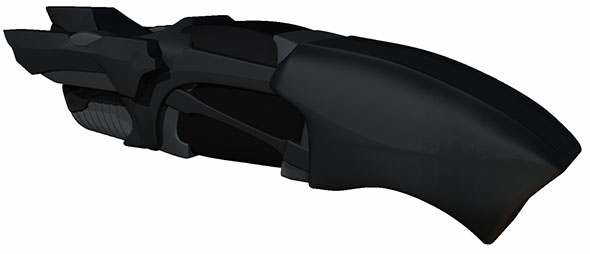

The Fleet Cruiser is the most common warship in the Imperial arsenal. It is the jack-of-all-trades spacecraft that carries Troopers and Stub Wings enough to take down ten or more Droid craft of a similar size. All are atmosphere capable and at 1700m long are the largest craft that come down to the planet's surface.  

## General statistics

*   Command crew (Captain, First Officer, Chief Tech, Chief Medic, Chief Combat Operations)
*   200+ Stub Wing pilots with 300+ Stub wings.
*   20 Drop ship pilots with 40 Stone drop ships. 
*   2+ Trooper Units (100 Troopers)
*   100 Engineers and Medic staff. 
*   30 support staff (gunners etc). 

## Power and drive

All Fleet craft use Ion generators that pull energy in its raw form through from a parallel dimension (the second medium). The generators are situated around the spacecraft such that if catastrophic damage is taken then it can still operate. It has 15 light jump engines of three different kinds. The standard engine is the Curve Surf engine that can chew through roughly 15 light jump units in an hour. The second type is Point-To-Point Light Jump engine, which allows the craft to jump a little further and instantly but requires a "cool down" where the spacecraft cannot jump. This is the same type of engine as used by many civilian craft. The final type is a standard Light Jump engine, which can only be used away from heavy masses (such as planets and stars). The reason for having different types is that each engine is progressively more reliable when faced with oddities in the space-time continuum.  

## Weaponry

The Cruiser has 25 20-gauge pulse laser clusters, allow it to fire up 25 different targets at once. Like civilian craft, each of these must be operated by a human gunner. The Cruiser is also fitted with two "from orbit" weapons that are used to support troopers on the group. The first is an Orbital Canon, which can fire devastating area-affect kinetic shells at a planet's surface and an Ion Lance, which is a beam of energy akin to a constant nuclear blast without radiation.  

## Model Designer Notes

The shape for the Fleet Cruiser has been exceptionally difficult for me to nail down. I have had the shape in my head for more than twenty years and getting that into 3D modeling software is exceptionally difficult. I have had many failed attempts and notebooks filled with drawings, designs and ideas. I finished the model in April this year and set about texturing it, making use of very high resolution "UV" image maps and lots of detail - far more than put into any other model.  

That's where it stalled. The shape was right but the renders looked wrong. While writing another post on "why spacecraft don't have windows", I realised that the Cruiser had to be smooth. I had piled on detail and with each line, indent, and sheen, I had stepped away from what a Fleet Cruiser is: a dark grey, featureless utilitarian craft. Smoothness is strength, every indent or nook is a weakness to be exploited. The semi-random "hull plate" patterns I use on the civilian renders would not be right on a Fleet Cruiser, the hull is woven in one piece, it's repaired by minuscule robots. The final render is plain but it is intended to be.  

## Where's the spec sheet?

I do not plan to create one as the Fleet Cruiser is not something that players can own. Instead they are to be used for awe in most campaigns, support in the up-and-coming Trooper's campaign.