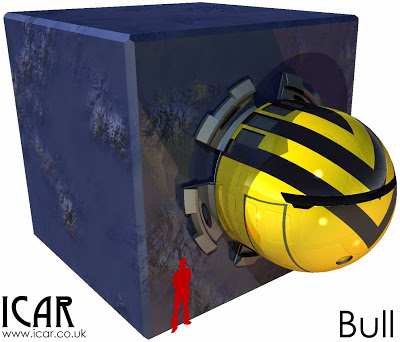

The Bull is a ubiquitous utility vehicle found across human occupied space. It attaches onto a huge variety of rear sections, making it extremely versatile. [Get it in the free, updated Equipment Index on DriveThruRPG](http://rpg.drivethrustuff.com/product/133598/Icar-Equipment-Index).  

The size of the Bull is ideal for use within a Mex city; while not being too small to fit a powerful set of generators and a Grav engine. Orbit capability and a ubiquity means that it fills and important gap in the Icar universe that has been missing for a very long time. If your group are up to any dodgy shinanigans then you can't go far wrong with a Bull, they are everywhere and the vast majority are yellow with black stripes!   

## Notes from the sheet

> Originally designed by The Vehicle Boutique in 34519, the Bull utility vehicle was an instant hit. Since then, the design has become a standard and Bulls are built without license by small manufacturing companies across Human Occupied Space. Reliability, simplicity and low cost, it can serve a huge number of functions from pulling spacecrates to medical evacuation.
> 
> The Bull itself is the cab of the vehicle, the rear part changes depending on its use. The most common Bull load is a common 10m cube space crate (pictured). Other common uses are flatbeds, heavy lifters and utility vans for small businesses.
> 
> The Bull can operate between the planet surface and orbit, although it is notoriously slow.
> 
> Being so commonplace, Bulls are connected with organised crime as they are the perfect vehicle for performing criminal acts in without raising suspicion.
> 
> Bulls lose their value immediately on purchase as second hand Bulls are difficult to determine the age or lineage. It can be difficult to tell if it is 10 or 1000 years old and what sort of a life it had.