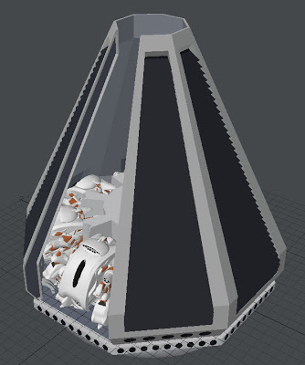
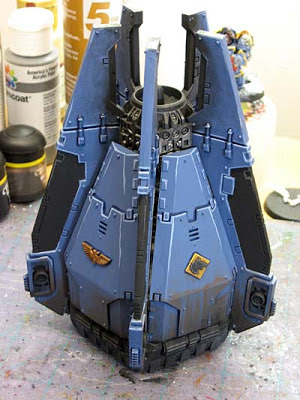

I want to show you how my art can go quite wrong. I'm currently working on the Droid pod (the Mk6), a single use light-jumping lump for delivering Droids to a distant system. The idea for the pods has been around for years, inspired by the [Apollo Command Module](http://en.wikipedia.org/wiki/Apollo_Command/Service_Module#Command_Module_.28CM.29). Here's the description from the Fleet setting book:  

> A Droid pod is an egg shaped one-use space craft that can perform a single light jump up to 4 units (4 squares on the cluster map). A pod carries a selection of Droids with the intention of landing on a planet, securing a manufacturing facility and then destroying all life. Pods carry a variety of Droids up to Mark 3. All Droids in a pod are the same variant.

 So I started with 8 Droids Mk3s facing outwards. Even if a few are mashed in the landing, there's plenty there to ruin the day of a player team of Troopers. I began by arranging the Droids in a circle and then built the pod around them using lots of octagon sections and cloning in a circle. I stopped when I got this far:  

It had the right kind of feel to it but looked a little too much like this:  

  
 Image from the Space Warp blog](http://fromthewarp.blogspot.co.uk/2010/05/space-wolf-drop-pod-and-comic.html)

 Which is a Warhammer 40K [Space Marine Drop Pod](http://warhammer40k.wikia.com/wiki/Drop_Pod). I know I can't invent everything afresh but I think my model cuts a bit too close to the bone on this one.  

## Stop, salvage, start again

At times like this, you can either keep going or salvage what you can and start again. For me, I can't put art into a book that is so close to something else. Anyone would have thought that I had copied the Space Marine Pod. Perhaps there was a subconscious draw toward the familiar. I can salvage the eight Mk3s in the middle but the outside is going to have to go. I might have to be a bit more literal with the egg shape. I hope that these thoughts give a little solace to other RPG authors who struggle with their art; you're not alone!  

I'll post up the finished Droid Mk6 pod when it is complete.