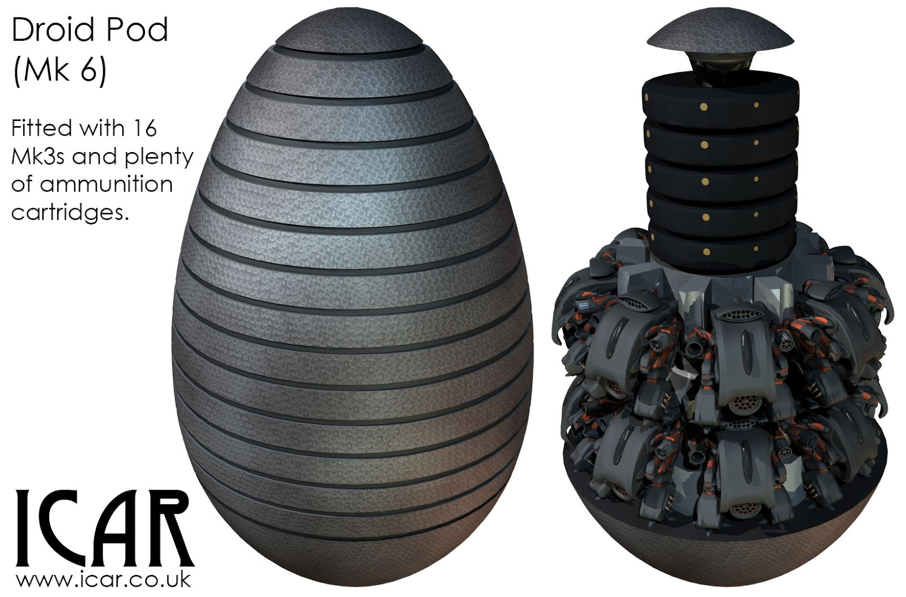

Success! If you've been following along, you'll know that the Droid Mk6 (Pod) has been something of a saga. My first attempt to create it fell over because the Droid Mk3s that I needed to go inside were too high in polygon count and it took forever to do anything. I ended up [recreating the models](../2014-12-17-never-leave-well-enough-alone). Cathartic but not helping me finish the Fleet Setting.  

That complete, I began diligently working on the Pod only to discover that what I was creating was far too similar to the [WH40K Space Marine Drop Pod](../2014-12-29-an-example-of-graphics-going-not-so-well). No doubt while I was creating it, I was channelling a deep subconscious echo from my past.  

This weekend I managed to squirrel myself away for just long enough to work on the model. Notebook sketches lay strewn across my desk, so it was easy to see it in my mind's eye.  

As the Pod enters a planet's atmosphere, the rings eject and fly back along its path until there is just the base of the Pod with the Droids standing on it. It's important that the Droid Pods are not a perfect design; they were simply *ideas* in the Imperial intelligence when the Droid scourge came and the Droids are unable to evolve designs. Every time a Droid Pod lands, some of the Droids inside do not survive.  

Now the Mk6 is out of the way (and not particularly exciting for me), I can take a deep breath and plough into the other remaining Droids.