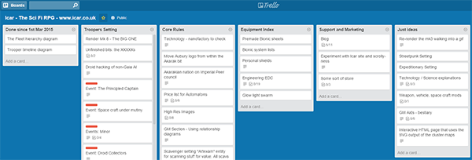
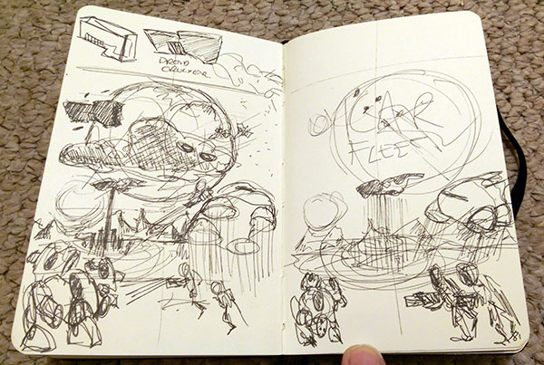
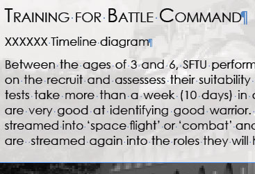
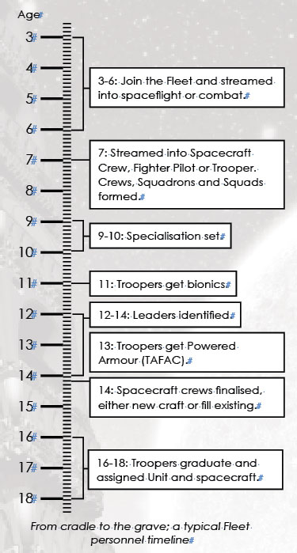

I've been hammering away at the Fleet Setting and it's coming along very well. Most of the graphics are ready and the Droids (as you've seen from the other posts) have mostly crawled from my digital easel. I'm rushing towards getting an very rough alpha out so that I can get some feedback while I build some more assets to pretty-up the book; not to mention the front cover.  

## Aren't you bored of it by now?

Working on one thing *is really boring*. Don't let anyone tell you that there is some sort of zen nirvana you can attain, it doesn't exist. The hot rush of starting something is replaced with the cliff face. You've got to grind through it. There's all the life detritus around the edge sucks out your creative energy. My personal time is shoe-horned in around work and family, often starting at 20:30! You're tired, it is easy to fall into the trap of "just 30 minutes of Elite:Dangerous", 10pm rolls around and you've run out of evening.  

## Get organised to get motivated

If I have something ready to start when I sit down then I am much more productive. If I can break something up into smaller bits, then I am more likely to finish something. I use two main things to keep organised, the wonderful [Trello](https://trello.com/b/46BJhlX1/icar-the-sci-fi-rpg-www-icar-co-uk) and a Notebook.  

### Trello

[Trello](https://trello.com/b/46BJhlX1/icar-the-sci-fi-rpg-www-icar-co-uk) is a way to organise everything. You arrange cards into lists, each card is a "thing to do". Cards can store lots of information such as lists, images, links, text and so much more. I arrange my lists by areas of Icar that I want to work on. The Fleet Setting, being the most important thing I have, so it gets its own list. Two of the lists are a bit special: **Done Since...** and **Just Ideas**. Done Since has all the cards that are complete since a certain date (in the title); It's important for me to see that because it's a track of progress. Just Ideas is where I put things I don't want to forget but don't want cluttering up my brain. Trello also has a mobile app; I use it to organise what I do in a given week. You might find useful for capturing ideas. I prefer my notebook for that...  

### Notebook

I always carry a notebook (Moleskines). Touching pen to paper is an immediate pleasure and I find that I write far more notes and doodles with it. Yes, my smarthphone can do all of that but I find it much easier this way. My notebooks contain everything; lyrics, new words, equations, diagrams, Christmas lists, rule ideas, quotes, scribbles, cartoon and Icar ideas. Here's a snap of the notebook page for some experiments in the Fleet Setting front page:  

  

It's a lot less tidy looking in the flesh. At the end of a notebook (if I don't wash it), I go through an number the pages, and create and index. I don't think it's entirely necessary but I have found that useful. 

## How I keep organised in the rules

I prefer a top-down strategy for sorting out my rulebooks. I write out all the topic headings, then sub headings and finally work on the content itself. If there is something I get stuck on, rather than spend time mulling it over, I'll either make an entry in Trello or put a bunch of "XXXXXXX" in there. I can then move on, knowing that I will search for "XXXXXXX" before I send the document out. For example, below is the entry in for the Trooper timeline chart:  

That's been in there for about 2 years! Now I am going back through the rules, I add the graphic in:  

## What's next?

I think the next big target for me is the Droid Mark 8. It's the city-crusher. I've talked about [my relationship with the idea](http://www.1km1kt.net/forum/viewtopic.php?f=11&t=6130) of the Mark 8 and now it's time to just do it. Drawings going into the notebook this week. After that, it's getting the text finished.