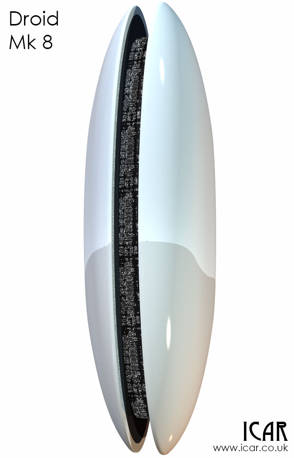

I probably shouldn't be posting this so soon but I'm really excited! I've managed to create the Droid Mk 8 - and I don't hate it! I've been sketching like crazy for what seems like an eternity and this one made it into 3D. I'm happy with it, I'm going to move on. The description from the Fleet Setting:  

> The Mark 8 is the final word in colony cleaning. At 150m tall and 50m wide, the the Mark 8 is designed to peel apart even the most stubborn subsurface colonies and inject Droids from inside. The hardened shell closes to form a smooth pill and using energy fields and a billion microscopic claws, it can burrow into colony and Orbital alike. Some later variant Mark 8s have also been known to burrow into the shells of Orbs but this is exceptionally rare.

 I will do some more renders with it in a city so that you can gauge the size of it. Its width will allow it to scythe through Mex cities without much problem. I've rendered it in its "perfect" state, I imagine that as soon as they get anywhere near dirt, dust and gunfire the pristine outside would soon become marked.  
 
 

## The best bit

My main reason for celebrating is that this has been a mental block for some time. I could not relax and just enjoy building the 3D model without worrying about if the idea behind the Mk 8 is right. How do I know it is right? Because I've fallen in love with it again. It has a purpose beyond the desires of the 14-year-old me to have a giant city killer stomping about.