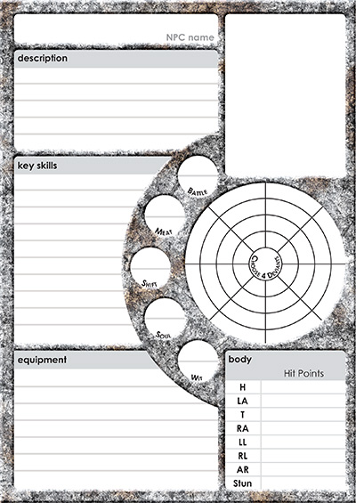
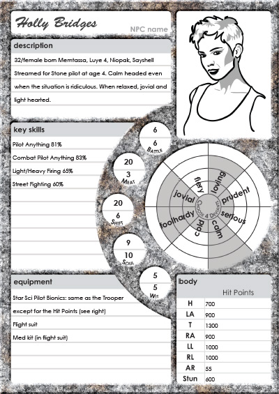

What is the bare minimum you need to know for an NPC? Well, it depends... it depends on how much time the characters are going to spend talking with the NPC. Sometimes a single sentence is enough, or a few adjectives. There's usually a name. There is a point where you need to start collecting more information about the NPC and that's where character cards and NPC sheets coming.  

## Character cards

A character card is a playing-card sized *player handout* with a picture of the NPC and some details. You can [download the ones I use on my Free RPG Blog](http://www.thefreerpgblog.com/2009/02/players-will-never-forget-their.html). The players can add notes to the inside of the character cards - they are for them.  

## NPC character sheet

For NPCs that become a regular fixture, you need a little more. Consistency in their abilities, initiative order and skills is vital in making the character appear real. Now you could use the normal character sheets for this task but the amount of paper you'll be carrying around might get out of hand really quickly. Instead, I have created a cut-down version of the character sheet for use with the NPCs.  

The strangest thing about the character sheet is the empty deviant wheel. Pick four pairs of deviant entries that you think best apply to the character and fill just those in. Check out the example that I am including the up-and-coming Fleet Setting, a Stone (dropship) pilot called Holly Bridges (don't worry, no spoilers there).  

## Design note - YAGNI

In extreme (or agile) software development, there is a phrase called YAGNI: You Ain't Gunna Need It. YAGNI means that you should never develop something until you need it, keeping features in systems costs money and if you're not 100% sure they will be used, don't put it in. I treat game design the same way.  

I have lots of ideas ([check them out](https://trello.com/b/46BJhlX1)) about what to put in and not all of them make the cut. Just because it goes through my head, it doesn't mean it should go into the book (some poor ones do get through).   

I didn't want to make an NPC character card as the vast majority of my NPCs are little drawings in relationship diagrams. That's usually enough to make them stick for me. I was writing the NPC description for Holly in the Fleet Setting and realised that there was a lot of structured information that was needed. It looked weird in the middle of the text. I wasn't going to be able to avoid it: I needed an NPC sheet. That was the point at which I needed it and not before.  

## Download it now

I will be adding it to the [Core Rules](http://www.drivethrurpg.com/product/133597/Icar) on the next update but rather than wait for that, [here's the PDF now](https://drive.google.com/file/d/0B2ThEbOVGt78dkF1X2oyejIzRDA/view?usp=sharing) (Google Drive, 1.2MB PDF).