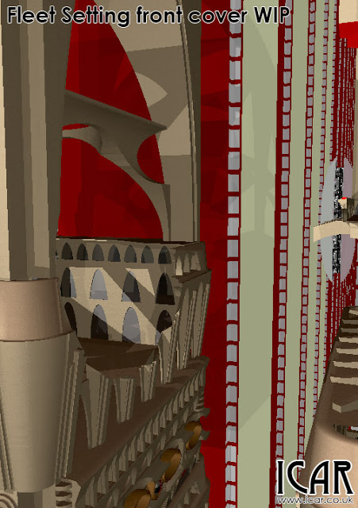

I have an image in my mind of a Mex city in the thick of a firefight. I want a [Mark 8 droid](../2015-05-05-quite-unexpected-surprise-droid-mk8) busting its way through in the background, while Fleet Troopers and [Mark 3s](../2014-12-17-never-leave-well-enough-alone) battle in the foreground. I want to get a Stone dropship in there, lots of streaks of lasers, smoke and a few battered buildings. In short, I want it to be a coherent mess.  

I've got a lot of the 3D models ready, they just need to be composed into a nice picture. What I've never been very good at is creating depth, lighting, atmosphere and people! I find that when I try something complex, it turns into an incoherent mess with nothing for the eye to latch onto.   

The image below is an early test render showing the larger, more static bits of the scene. You can see a [Mark 8](../2015-05-05-quite-unexpected-surprise-droid-mk8) moving through the buildings, which are set out in red and green for the moment (will be replaced later). I've made some cuts into the foreground buildings and these will have a few interior walls. The cut out curved section in the building on the left will hold a smoking [Mark 6](../2015-01-06-droid-mk-6-pod-complete) (pod).  

I am tempted to finish off the scene by hand (in [GIMP](http://www.gimp.org/)) as it is much easier to apply grime/burn marks after the rendering has finished. I'll try the same for the laser blasts but that might need some experimentation. I'll need to work out how to do volumetric fog/smoke and atmospheric lighting. I've tried doing smoke by hand in post-rendering and it looked terrible when not on the horizon!