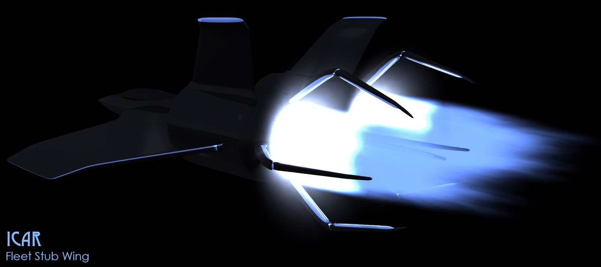
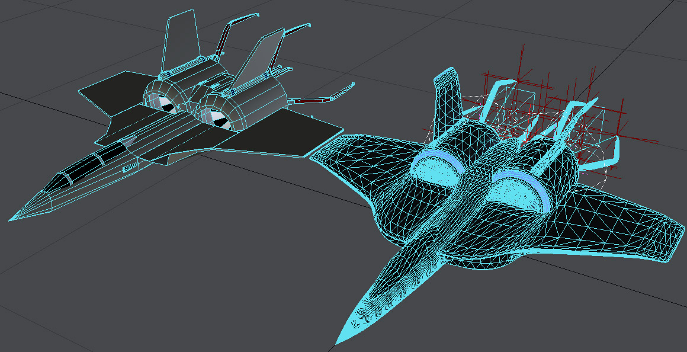

Icar has grown up with [my friends and I](http://www.icar.co.uk/archive/history.php). A collective hallucination that has become more detailed (and complex) with each passing year. There are still strong echoes from the early days: infectious mutant-zombies, killer robots and [lots of big guns](http://www.rpgnow.com/product/133598/Icar-Equipment-Index). One thing that has morphed only slightly is the Fleet's Stub Wing. Here's my latest render showing it at full thrust (click for a biggy).  

## From 1998 to 2015

My first scribble was in pencil and paper around 1991 but I've since lost that folder with all my original drawings in. I did a 3D model in 1996 but that died on a hard-drive so the oldest incarnation I have of the Stub Wing is from 1998 - and I still have the 3D model for it! Here is old (left) and new (right) side by side.   

 

It's easy to see how far my 3D modelling has come, although it can be pretty painful sharing the old models. Here they are without the polygon lines. 

The spikes that stick out of the back are the energy thrust vectors. The idea was that all that thrust forced from the back would go in all directions, so you need an energy field to try and contain it. In turn, that energy field would need some strong emitters and that's where the spikes come from. In the original model, the spikes were fixed but in the new one I have them all rigged up so that they can move around.  

## Next steps

Now I have the new Stub Wing rigged (with the thrust particles and lights), it's ready to go. I can now use it in a scene with a Mark 4 Droid and get that into the Fleet Setting book. I'm tempted to put some on the front cover too - I didn't before to stop it from looking busy. I'll give that another thought.  

Do you like seeing the works in progress and archive images from yesteryear? Please do let me know on [Twitter](https://twitter.com/icarrpg), [Facebook](https://www.facebook.com/icarrpg?_rdr=p), [Google+](https://plus.google.com/u/0/b/101167212141043946609/101167212141043946609) or in the comments below.