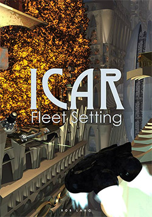
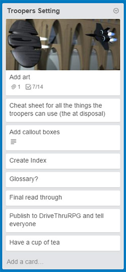

Twenty fifteen, Icar's 21st year, has been a good one. Let's have a healthy round-up of this year before setting out what 2016 will hold. It's important to do this because it can be easy to forget the progress you *have made* when looking at what is left to do.  

## First Half

In January, I won a struggle with the [Droid Mark 6 pod](../2015-01-06-droid-mk-6-pod-complete). The egg-and-rings approach feels right and I don't want to touch it again, which is a great sign.   

Shortly after, I completed the [Droid Mark 7 colonial factory](../2015-01-15-droid-mk7-colonial-factory-turned), which is an idea that's made its way into the notes of every campaign I've run but I've never got round to using it. The players, curse them, always scarper before I get a chance.  

In May, I explained how I [stay motivated](../2015-05-04-fleet-setting-progress-report-and-how-i) by keeping organised. Icar takes up 12.3GB on my hard drive now, a statistic inconceivable 21 years ago, keeping all that information useful takes some effort and I don't want to feel swamped by it all.  

The very next day, I was delighted to have finished the [Mark 8 Droid](../2015-05-05-quite-unexpected-surprise-droid-mk8). This city-destroying megalith was once a robot (18 years ago) but as the game matured, the idea failed to grow with me. The new, sleek Mark 8 makes me very proud. It feels right.  

In June, I shared the much needed [NPC character sheet](../2015-06-03-new-download-npc-character-sheet) and Holly Bridges (the Stone dropship pilot from the Fleet Setting) as an example. It will go in the next update of the core rules.  

I also began work on the [Fleet Setting front cover](../2015-06-22-work-in-progress-fleet-setting-front). I usually do the cover last because I like to compose a cover from the same 3D assets I use within the book and they are normally only ready at the end.  

## Second Half

In August my campaign came to a natural end and I lost a valued player from my group. To make it easier to entice players at a distance, I decided to run the next campaign onto Roll20, with some success. I decided to build the setting differently this time, relying more on [description first](../2015-08-17-text-first-new-way-to-fill-in-campaign), which was a big change for me.  

In November, I wrote up how [Spacecraft Systems work](../2015-11-01-spacecraft-systems) for a new player who was keen to be the engineer. I am sorely tempted to start the Technology book but not yet! Must finish the Fleet Setting.  

I also [reworked the old Stub Wing space fighter design](../2015-11-22-the-fleet-stub-wing-i-first-drew-it-at), which I can't bare to modernise too much. It's still a bit rough around the edges but I love it dearly, like an old friend.  

Finally, November saw the completion of the Fleet Setting front page (announced on [social media, I was that excited](https://www.facebook.com/icarrpg)), something I am exceptionally proud of. I had to learn a whole bunch of new skills to complete it and although it's not perfect, it's good enough.  

## Statistics!

I keep an eye on statistics but only so that I can thank people who link through to the site. The [downloads from DriveThru](http://www.drivethrurpg.com/browse.php?manufacturers_id=7130) are in the "long tail" of a product now, having 1297 downloads (both books) and $51.22 donated. That's very kind indeed. I imagine releasing the Fleet Setting will see another spike. Here's the graph since I started with DriveThruRPG, for 2014 and 2015.  

<iframe width="766" height="473" seamless="" frameborder="0" scrolling="no" src="https://docs.google.com/spreadsheets/d/1pGq0PNMEFhC98VBFGhbgBfubFvCJXzpTecY_0RYQnvs/pubchart?oid=1381679484&format=interactive"></iframe>  

The website has had 3219 users and 5800 page views. 72% are new users, 50% from the USA and mostly gained from organic search or referral from the sadly quiet [The Free RPG Blog](http://www.thefreerpgblog.com). 

## Twenty Sixteen

Enough navel gazing! Twenty sixteen will see me attack the [Trello board](https://trello.com/b/46BJhlX1/icar-the-sci-fi-rpg-www-icar-co-uk) with gusto. The Fleet Setting WILL get finished, I will release a small update to the core rules. I am also tempted to update the website, something I do [for fun anyway](http://www.icar.co.uk/archive/pagehistory.php).  

I also want to create a little web app for supporting online gaming with Icar. Character sheets and the like. It will give me an excuse to play with some new technology, something that has crossover for me as I am a programmer by trade.  

## Thank you

Thank you to everyone that continues to support me; especially my players, who give me frank feedback on everything I try. I am over the hump with the Fleet Setting, so feel very much downhill to the finish line.