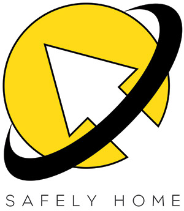
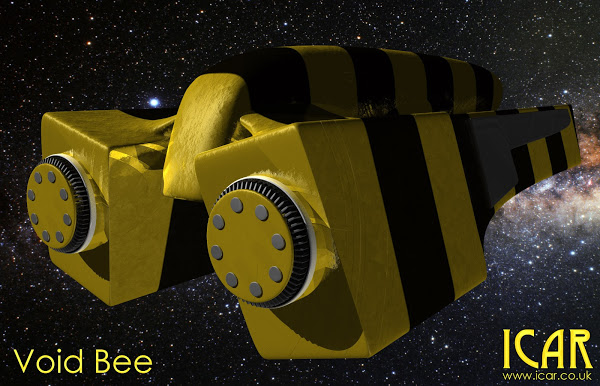

Void Rescue is the space rescue service. If your spacecraft has broken down, you can call Void Rescue to come and help. With over 1 million spacecraft across all Human Occupied Space, their yellow and black stripes are instantly recognisable and affectionately known as *Bees*. The crews are highly trained engineers, who can help find problems with your spacecraft. Most trade spacecraft have Void Rescue insurance cover and some colonies require it before awarding a trade contract.  

## Service Levels

Void Rescue will always attempt to repair your spacecraft. They carry a huge array of spares, which you can buy from them. If they can't repair your craft, then will try to attach temporary equipment (see below) to your craft and jump you to the nearest star dock, where you can negotiate repairs. If the spacecraft is in tatters then Void Rescue will guarantee to safely deliver you and your crew to a nearby system.  Void Rescue will also pick you up from a planet, asteroid or orbital if you spacecraft is destroyed. Used in this way makes Void Rescue a very expensive courier service but then if you have paid for it, you might as well use it!  

### Droid Space

Void Rescue do offer cover for Droid Space but they do not guarantee to get to you. The deeper you are, the more unlikely it is that you will get a message to Void Rescue. If you are any more than 4 clusters into Droid space (the Sectors of Typhon and Eos) then it's unlikely that you'll get a message back to Human Occupied Space, let alone be picked up.  

## Pricing

The more you pay up-front, the cheaper it will be overall. 

|Contract|Location|Price|
|--- |--- |--- |
|5 years in advance|Human Occupied Space|500,000|
|1 year in advance|Human Occupied Space|200,000|
|Immediate pickup (no payment in advance)|Human Occupied Space|300,000|
|1 year in advance|Droid Space|1,300,000|
|Immediate pickup|Droid Space|2,000,000|

## Response times

In Human Occupied Space, a Void Rescue craft will be with you within 10 hours. If you are close to the centre of the Sector (where the star density is highest) then the usual time 3 hours.  

## Temporary Equipment

Not only does a Bee carry a large number of spares, they also carry specialised equipment for making your spacecraft (anything smaller than a hulk) go far enough to get to a star dock. Anything included in the diagram on the [Spacecraft Systems](../2015-11-01-spacecraft-systems) blog post can be temporarily replaced.  

 

## The Gaia show: The Hive

A very popular, romanticised Gaia soap opera called The Hive has always danced along the interstice between fact and fiction. It follows the beautiful crew of a fictional Bee called Stardust, each show performing a daring rescue. The crews of real Bees hate the show. For many it was the reason they joined and its false glamour feels like a betrayal. Mentioning The Hive in conversation with Bee crews rarely goes down well.  

## The Star Enforcer Alternative

If you have no Void Rescue insurance and you cannot afford the cost of an immediate pickup then you can put a distress into the Star Enforcers. The Star Enforcers will take your crew to the nearest system and your spacecraft and cargo will immediately be listed as salvage. This only works in Human Occupied Space, in Typhon Sector you can try the same with the Fleet but you are likely to be their lowest priority.  

## Void Rescue Engineer Skeleton

Void Rescue Engineers can make great engineers for you space based campaign. Schooled amongst the harsh reality of the Void, these engineers have a tight focus on spacecraft.  

> There's no buzz like that hum of a Grav engine warming up from cold. There's no smile broader than caused by an old tub pulling under its weight again. There's no thanks sweeter than a Captain's open hand. I've seen the innards of every kind of spacecraft humanity has sculpted. Each like a giant living thing that I get to make well. It's enough to bring a tear to this old engineer's eye...

### Suggested Attributes

* Wit: 5 

### Skills

* Gaia Know  
* Pilot Heavy Grav 
* Pilot Cruiser 
* Zero-G Operations (5 x Shift) + 3D10 
* Spacecraft Know (6 x Wit) + 3D10 
* Spacecraft Systems (5 x Wit) + 2D10 
* Energy Know (3 x Wit) + 4D10 
* Energy Systems Wit + 2D10 
* Mechasys Know (5 x Wit) + 2D10 
* Mechasys Systems (3 x Wit) + D10 

### Starting Equipment

Shakespeare Mech Kit. 2 Changes of clothing. Moss Hardened Environment Suit (with communicator and Grav pack). Personal Effects.  