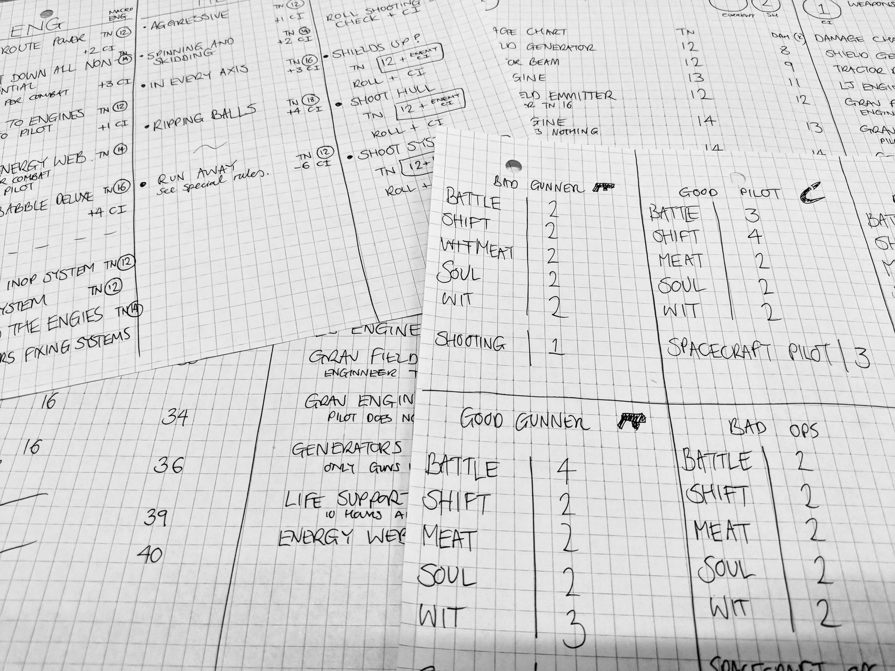

[Space combat - Building up Combat Initiative](https://trello.com/c/V6TKxN4h/151-space-combat-building-up-combat-initiative)

Version 5's core mechanic comes into it's own when built into space combat. The core principal is still the same as in version 4: every player character has a job to do, they roll skills to keep the spacecraft together and help the gunners shoot. Everyone (except the gunners) has more options and the effect of any action is more obvious. For example, if an engineer chooses to put power to the engines then the pilot gets +2 to their roll.  

It's also easier to see how one character can hold up the team. If the pilot is unskilled then their failing doesn't have a negative effect but the lack of positive effect makes it hard for the gunners to fire. The engineer then has the choice to try and buff the pilot (normal difficulty) or to buff the combat initiative directly (more difficult). Those choices are extremely important as simple systems can sometimes feel like they are "roll to win or lose".  I'm currently writing up the rules in Trello, you can see them (and my progress) on the right. It's free to use, click through and see what I'm up to.  

## Designing in pen

I took a conscious decision to design in pen for version 5. The reasons are:  

* Pen is quicker. Going straight onto digital bogs me down on getting things too perfect or programming it. 
* It's easier to take design materials to the park for lunch. 
* Sitting scribbling in the evening is less socially excluding than using a laptop. 
* It's easy to be distracted on a computer.  
* For the play test I need example builds of characters that are stripped right down, so it made sense to write them out. 
* I can then put them together by myself for fun before giving over to some players. 
* This isn't really for min-maxing but for understand the effects if each role.  

 

## Playtest coming

I hope to get the playtest down by the middle of March so that I can write them up. The space combat rules are like the new vehicle rules but more prescriptive. If I can get the spacecraft rules nailed down then the vehicle ones should come out in the wash.  