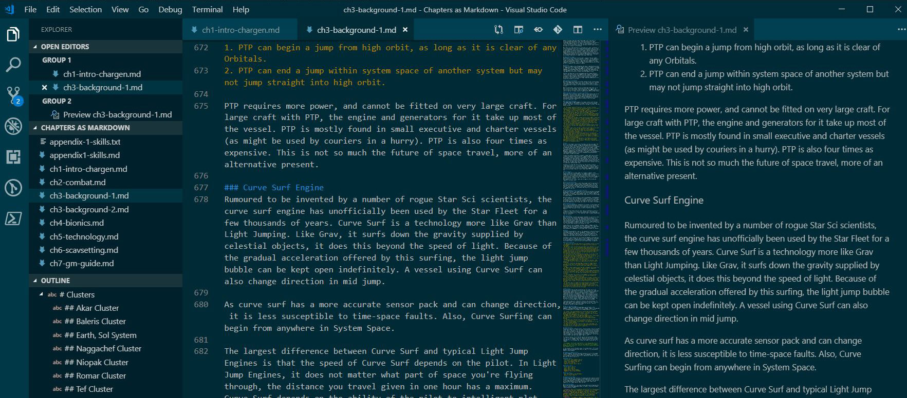
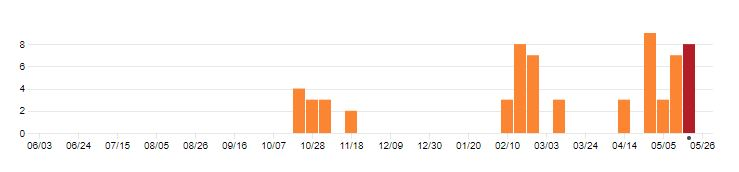
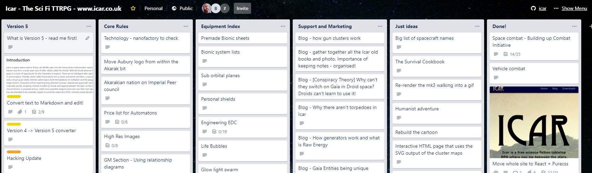

Welcome to the new website! If you're reading this then chances are you're doing it on the new website. In this post I'm going to talk about what I did to put it together and then talk about how V5 editing is going.

## Website v12 - 2019
It's clean, fast, designed with mobile in mind and although a little over-simple in places, it will let me update content more quickly and easily. There are some missing pages (the old Icar toons, web page history) but I will get them online in time. 

It's taken a long time and a lot of effort to update the site - much more than before. This is partly because I needed a way to blog more reliably and I wanted to stop using PHP to perform the template formatting. I was using Blogger for the blogging and although I still like it; I found that I was fighting with the formatting more than I was just creating content. I want to be able to type without distraction and Blogger couldn't give me that. I also wanted the blog to be all on the same site, where I control the content. I [wrote a little tool](https://github.com/brainwipe/BloggerToMd) to take the Blogger XML and turn it into [Markdown](https://en.wikipedia.org/wiki/Markdown) format.

I was using PHP before for turning the raw data (teams and so on) from XML into HTML. I have converted all that data [into JSON](https://github.com/brainwipe/icar/blob/master/web/gatsby2019/src/data/teams.json). I don't care too much about the format of the data but JSON is marginally cleaner. I also wanted images to be hosted locally and to have them scale nicely depending on whether you're looking at them in a browser or on a desktop. 

I could have written something myself but instead I chose [GatsbyJS](https://www.gatsbyjs.org/) to turn the Markdown into static HTML pages. It also goes through a "build" process, which tells me about dead links or incorrectly linked images. That's very handy! Now that is all done, I can concentrate more on the content.

## V5 Editing Progress
I love writing in the [Markdown format](https://en.wikipedia.org/wiki/Markdown), it's simple and gets out of the way of just writing. In past years, against all the best advice, I have edited straight into the layout (by building the layout first). This was a bad idea. It's not dreadful if you've already got the PDFs out and you're rewording some sentences but for writing large volumes of text, it's terrible as making changes can be time expensive. Time I don't have.

So, I've taken to editing in [Visual Studio Code](https://code.visualstudio.com/), which although is designed for coding, it very familiar to me for editing documentation and the like. My aim is to get all of the core book written and then import into a layout program. You can see what it looks like below. I have outlines on the left to show files and document structure, I edit in the centre and then preview on the right. A small joy is that I blog in _exactly the same way_.

## Bye bye Scribus, Hello Affinity Publisher
By [their own admission](http://forums.scribus.net/index.php?topic=2760.0), the free DTP package [Scribus](https://www.scribus.net/) isn't good for long documents, which Icar definitely is. I wanted it to be in Scribus so that anyone could edit Icar without any financial outlay. I tried importing and adding images and even the latest Beta version ground to a halt. It's just not capable of handling chunky documents - even on my rather powerful home computer!

I'm going to play with [Pandoc](https://pandoc.org/) for converting the markdown and [Affinity Publisher](https://affinity.serif.com/en-gb/publisher/) for the final layout. Publisher is free in Beta at the moment, but will a paid-for eventually. Big thanks to [Emmett (author of sister RPG The Artifact)](http://www.theartifact.net/) for pointing me in Affinity's direction. I completely agree with him that when Publisher is out of Beta, it will be around the same price as it's other products and I'm happy £45 for an Adobe InDesign replacement.

## How _you_ can see my changes
A side-effect of writing in Markdown is that Github, which is my [open source repository for all the Icar stuff](https://github.com/brainwipe/icar), converts them into something readable automatically. For example, you can check out [Chapter 1](https://github.com/brainwipe/icar/blob/master/books/core/Chapters%20as%20Markdown/ch1-intro-chargen.md) and [Chapter 2](https://github.com/brainwipe/icar/blob/master/books/core/Chapters%20as%20Markdown/ch2-combat.md) right now. For fun, you can checkout the [unformatted ones too](https://github.com/brainwipe/icar/tree/master/books/core/Chapters%20as%20Markdown).

If you're the sort of person who loves a graph, you can check out the [commit activity](https://github.com/brainwipe/icar/graphs/commit-activity). A commit is a bunch of changes together. Commits also include these blog updates. You can see the [whole list here](https://github.com/brainwipe/icar/commits/master).

 

## Right now...
I'm editing the background chapters. They have not received a lot of editing since I first wrote them and I'm concerned that they have a lot of flavour that's not particularly useful. It became something of a dumping ground. I'm also learning [Blender](https://www.blender.org/) and I hope to build the new graphics I need for character sheets in it. I will need to learn Affinity Publisher at some point but I am putting that off until I have most of the text done.

## Road Map
I'm still keeping my [Trello Board](https://trello.com/b/46BJhlX1/icar-the-sci-fi-ttrpg-wwwicarcouk) roadmap up to date with all the changes I am tracking. Rather proudly, I'm happy to see that the website and core mechanics are all in the Done column on the right.

