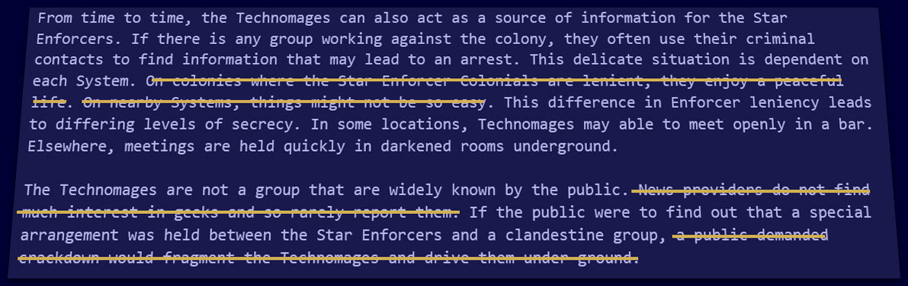

I'm heavily editing the text of Icar for version 5 and by doing so, I'm trying to do the following:

- Make it easier to read
- More GM hooks
- More ideas for the players

With that in mind, I thought it might be fun to demonstrate _how_ I'm going about editing it by using a syndicate description - in this case the venerable Technomage Syndicate as an example.

## 1. Existing Text
It begins life as **724 words**. It's quite repetitive and over-eggs how law abiding they are. This is how it appears in Version 4 (the current version).

### The Technomages
Philosophy: Technologist. Members: Over 10 billion. 

The Technomages aim to support home technologists and to aid the spread of learning in technology. Although these aims sound honourable, some of the technology which is supported is considered illegal by the Imperium. Their illegal interests also reach into handling of stolen goods, harbouring known criminals (especially other Technomages) and supplying equipment to known felonious groups (such as The Machine). Although massively Intersector, the majority of the ruling Mages are based in the Turus Cluster, which is home to the Star Fleet. The size and proliferation of science of the colony makes it the perfect hiding place.

What makes the Technomages unique is their standing with the Star Enforcers. Although they are a clandestine society, most of the Mages are good, law abiding, loyal citizens who have the Technomages as a source of job or hobby. The Star Enforcers mostly see them as a harmless organisation that would take a lot of effort to arrest without actually removing many criminals from the streets. 

From time to time, the Technomages can also act as a source of information for the Star Enforcers. If there is any group working against the colony, they often use their criminal contacts to find information that may lead to an arrest. This delicate situation is dependent on each System. On colonies where the Star Enforcer Colonials are lenient, they enjoy a peaceful life. On nearby Systems, things might not be so easy. This difference in Enforcer leniency leads to differing levels of secrecy. In some locations, Technomages may able to meet openly in a bar. Elsewhere, meetings are held quickly in darkened rooms underground.

The Technomages are not a group that are widely known by the public. News providers do not find much interest in geeks and so rarely report them. If the public were to find out that a special arrangement was held between the Star Enforcers and a clandestine group, a public demanded crackdown would fragment the Technomages and drive them under ground.

### Organisation
The Technomages have a number of ranks which is shown as black bands around a blue strip of cloth called a 'Mobius'. Advancement comes through aiding others, creating innovative pieces of technology or by helping out non-Technomages gratis using technology. Joining the Technomages is by invitation only. The smallest unit of the Mages is a 'Cell' which consists of anything up to 50 people spread across an Orbital, Colony, System or Cluster. A cell works on a similar area of technology (such as Star Craft). 

Where there are many different cells in an area, they are grouped together called a Clan. A Clan usually consists of Cells with very different interests. The Cells within a Technomage Clan share knowledge and look after each other.

A Clan issues awards to their Mages in the form of decoration on their Mobius. Awards are gained when a Mage has excelled in their field by creating a piece of technology or research that furthers the knowledge of humanity. The promotions are shapes that signify different achievements in different Clans but are all celestial objects such as stars, planets, moons, nebulae, black holes etc. Promotion is awarded when the Technomage has an all round commitment by helping others and putting a lot into the Cell's community. 

### Rumours
The Technomages have been around for an extremely long time, their origins somewhat vague. One rumour is that the Star Sci set up the Technomages to better monitor and control the general public toying with technology. Star Sci are notoriously difficult to contact and have technology far in advance of anything in the public domain. Whether they have their scientists embedded in the Technomages remains a mystery.

### Using the Technomages
The Technomages are everywhere and in heavily populated places, there can be thousands. They are useful for identifying unknown bits of technology, sourcing rare pieces of kit and getting hold of experimental systems. Cells where the topic of study gives rise to dangerous illegal technology will be more difficult to contact. High concentrations of Technomages will offset that difficulty.

The Technomages can be contacted through the usual channels of the Undergaia but it's also possible to meet them by attending local technology social gatherings, seminars and exhibitions. If you know to look for the blue bands, they can be found.

## 2. Bullet Point
The first step is to read through it and compile a list of bullet point items. Some of the features in this list are not specific to the Technomages (such as the SEC leaving the nice ones alone) so they can be moved out to another section. Although I compiled the list to match the order in the text above, I then reordered it to group similar statements together. I've also added items that help make the section useful to GMs and players.

### Bullet Point Technomages
- Technologist
- Aim to spread the knowledge of technological invention
- Across all Human Occupied Space, 10 billion members
- They remain secret from the general public
- Rumoured to be set-up by Star Sci to control homebrew technology.
- The more dangerous and illegal their field of invention, the further underground a Technomage cell will be.
- Star Enforcers think them mostly harmless, only when the inventions become a danger to the public do they get involved. 
- Star Enforcers occasionally use the Technomages for information, in exchange for turning a blind eye.
- Ruling Technomages based in Turus cluster (home of Star Fleet)
- Technomages are organised geographically into clans and then by technology field into cells. 
- A Technomage has a numbered rank and awards for aiding other Technomages, innovating or helping out the general public using Technology.
- Each mage wears a blue strip of digital cloth called a Mobius, which shows membership and standing. Black bands wrapped across one end represent rank and celestial objects represent awards and achievements.
- Relatively easy to find through Undergaia, good for custom technology, upgrades to spacecraft, weapons, vehicles, bionics etc.
- They go looking for help - good for mission hooks
- Being a TM is good flavour for engineer character background

## 3. Reconstitute Text
With the core facts written down, they can be reconstituted into new text. From **724 words** down to **269 words** and with more useful content.

### Reconstituted Technomages
The Technomages are a syndicate spread across Human Occupied Space with 10 million members. Their aim is to spread knowledge and love of technological innovation. They are secret from the general public and the Star Enforcers regard them as mostly harmless, stepping in only when the inventions become a danger to society. The more dangerous the field of invention, the more careful and underground the Technomages will be. Rumour has it that Star Sci created and secretly funds the Technomages as a way to control dangerous homebrew technology and recruit new scientists.

Technomages are organised hierarchically, their leadership being based in Turus cluster, Sayshell (home of Star Fleet). They are grouped together geographically into clans and each clan is split in cells of 50 people. A Technomage has a numbered rank and receives awards for helping other technomages, long service, innovation or helping out the general public with technology. Each Technomage wears around the wrist a blue strip of digital cloth called a Mobius, which shows membership and standing. Black bands wrapped across one end represent rank and celestial objects represent awards and achievements.

Technomages are common, easy to find through Undergaia and at local tech meetups. They're good for custom technology, upgrades to spacecraft, weapons, vehicles, bionics, etc. The blue Mobius is a common giveaway. Their payment is often cheap but there is a possibility that you will be shopped into the Star Enforcers. On occasion, Technomages will come looking for help, they aren't a rich syndicate but they can offer cool technology in return. Being a Technomage can add flavour and sub-quest opportunities to a player character.

## 4. Later: The Final Edit
When I come to perform a final read through of the whole book, I will no-doubt make changes - reducing the text a little more. That's for later, though. It is important to keep moving through.